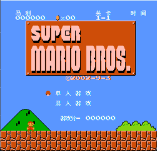
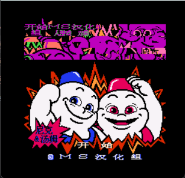
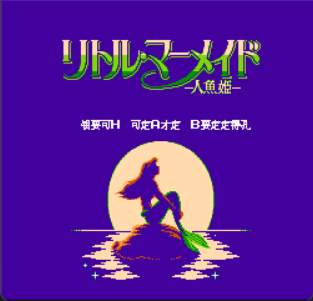
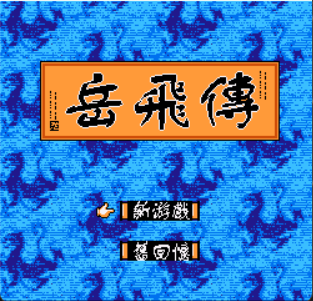
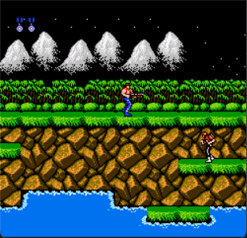

# NES Emulator

[中文](README.md)

This is a NES emulator project based on Zhongdian Yuanzi's NES emulator. The original project used ARM assembly for CPU,
making it impossible to port to other platforms. This project rewrote the CPU part in C language, **designed for easy
porting to various embedded devices** (such as STM32, ESP32, etc.).

## Supported Mapper List

0, 1, 2, 3, 4, 6, 7, 8, 11, 13, 15, 16, 17, 18, 19, 21, 22, 23, 24, 25, 32, 33, 34, 64, 65, 66, 67, 69, 70, 71, 72, 73,
75, 76, 78, 79, 85, 87, 88, 99, 113, 189, 225, 227, 240, 245


## Game Controls

| Key       | Function |
|-----------|----------|
| W         | Up       |
| S         | Down     |
| A         | Left     |
| D         | Right    |
| ← (Arrow) | A Button |
| → (Arrow) | B Button |
| H         | Select   |
| Space     | Start    |

## Project Structure

```
nes/
├── nes_cpu.c/h     - CPU Core (6502)
├── nes_ppu.c/h     - Picture Processing Unit
├── nes_apu.c/h     - Audio Processing Unit
├── nes_mapper.c/h  - Mapper Support
├── nes_main.c/h    - Main Logic
└── mapper/         - Mapper Implementations
```

## Screenshots

### Mapper 0 - Super Mario Bros


### Mapper 1 - Snow Bros


### Mapper 2 - The Little Mermaid


### Mapper 4 - Final Fantasy III


### Mapper 15 - Yue Fei Zhuan


### Mapper 23 - Contra 1


---

Looking forward to contributors to improve this project!
